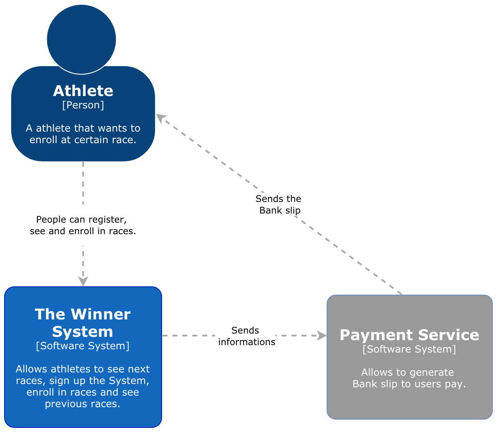
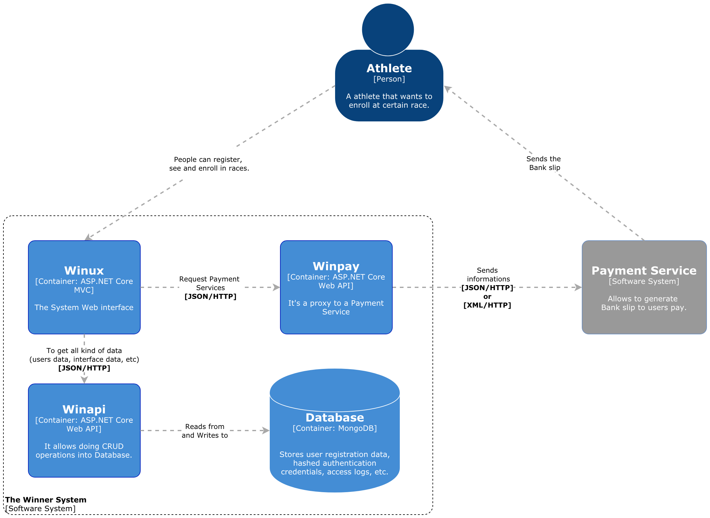
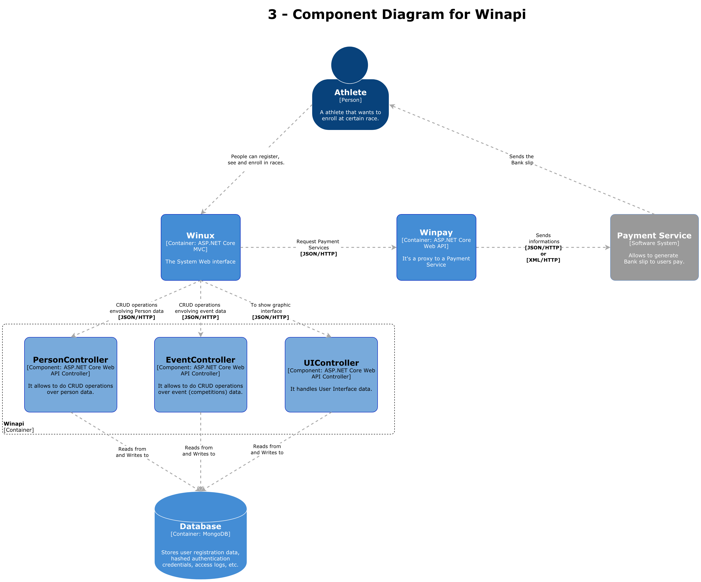

# Winner

The Winner is a system for enrolling in street running marathons. The whole system is composed of Front-End (in future development) and Back-End (current repo).

## Winapi

The Winapi is the api that consumes the database. The Winapi is written using [ASP.NET Core](https://dotnet.microsoft.com/learn/web/what-is-aspnet-core) Web API technology. When it comes to development techniques, the Winapi has been written using Test Driven Development (TDD).

The Database technology chosen was [MongoDB](https://www.mongodb.com/), which is Non-Relational database model.

## System Context Diagram
The System Context Diagram shows the big picture of any Software application.

## Container Diagram 
The Container Diagram shows some detail of the System, exposing the internal Containers (APIs, Web Site, Database etc).

## Component Diagram of the Winapi
The Component Diagram shows more detail of some components. The bellow picture shows the internal details of the Winapi Component. You can see that the Winapi uses different controllers for different kinds of data.

