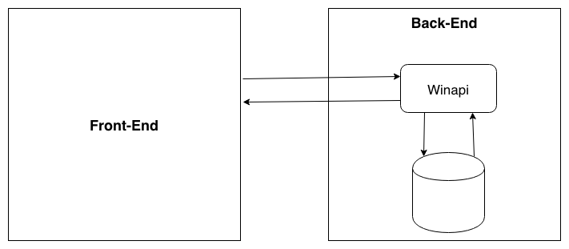

# Winner

The Winner is a system for enrolling in street running marathons. The whole system is composed of Front-End (in future development) and Back-End (current repo).

## Winapi

The Winapi is the api that consumes the database. The Winapi is written using [ASP.NET Core](https://dotnet.microsoft.com/learn/web/what-is-aspnet-core) Web API technology. When it comes to development techniques, the Winapi has been written using Test Driven Development (TDD).

The Database technology chosen was [MongoDB](https://www.mongodb.com/), which is Non-Relational database model.

## The Winner Overview

The figure above summary the Winner project at this moment.

